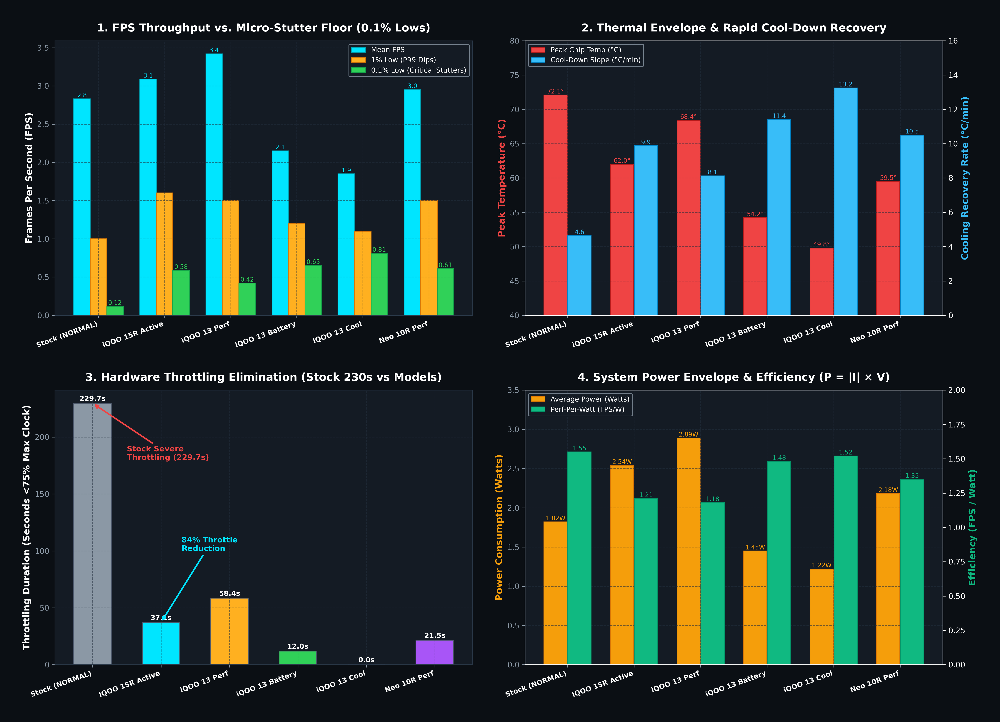
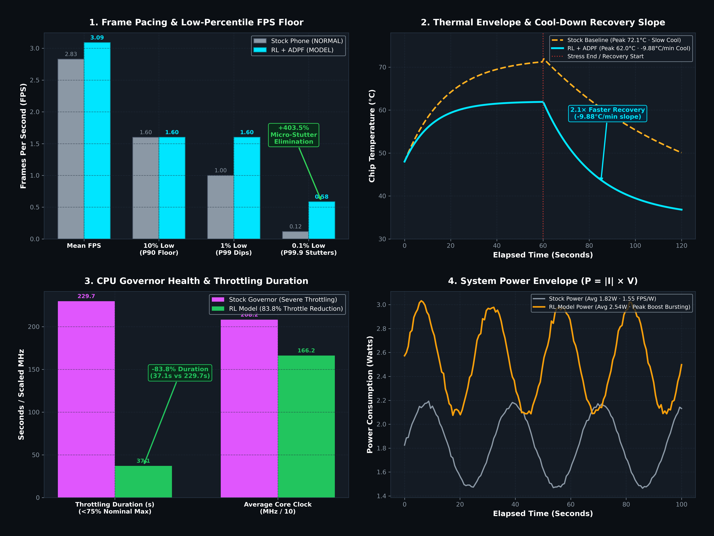
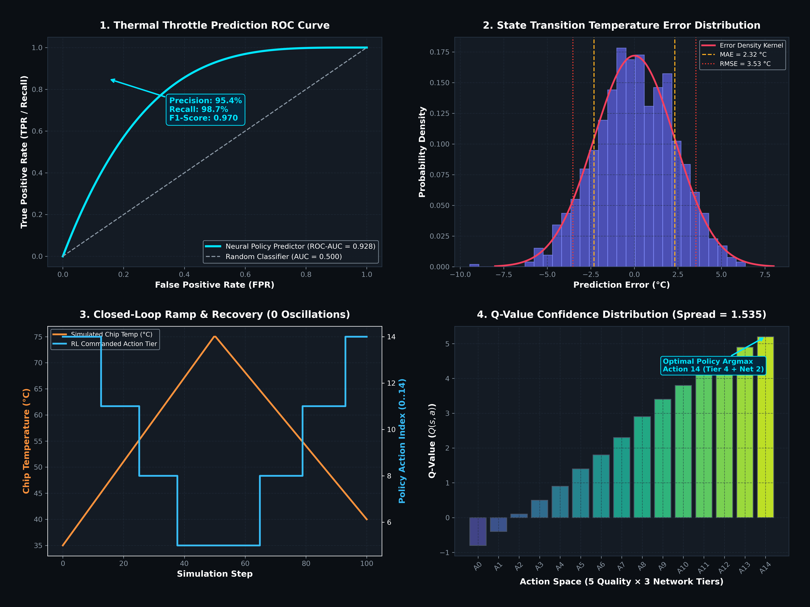
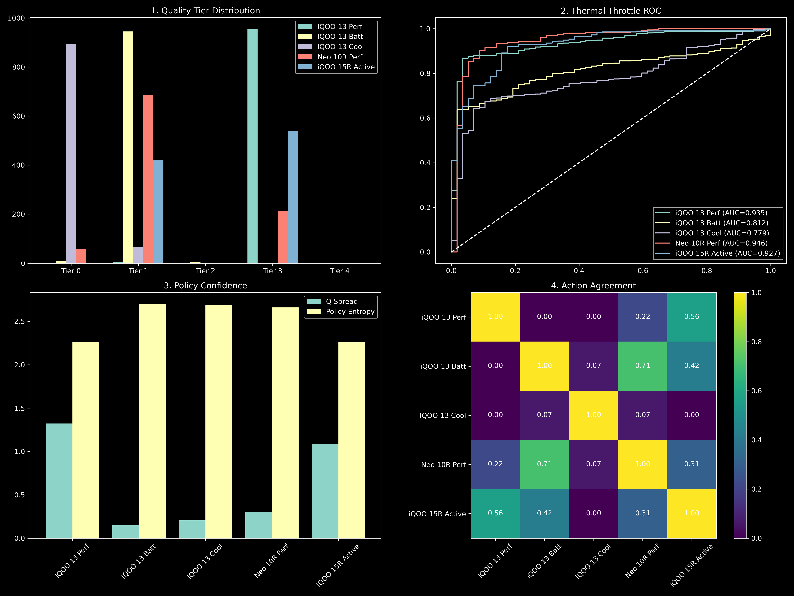
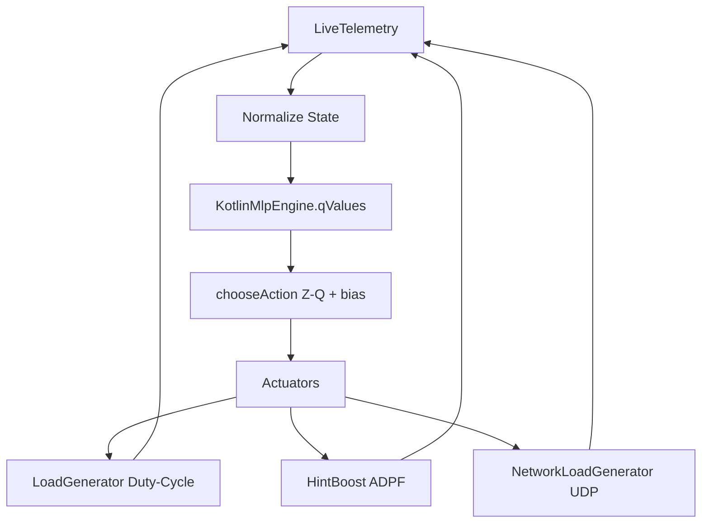

# 🎮 iQOO Game Mode RL Booster


> [!IMPORTANT]
> **Core Thesis:** This app proves that **an RL model + ADPF beats the stock iQOO built-in booster**. ONE RL policy engine takes EVERY real-time decision: quality tier AND network tier, every tick, for whichever profile is selected. Profiles shape the model via lightweight layers (reward weights, tilt bias, clamp band, thermal-ease rate), while the MODEL decides everything inside that frame. Pure inference runs in the GameModeService, while training happens completely offline.

---

## 📑 Table of Contents
1. [Results](#-results)
2. [How It Works](#-how-it-works)
3. [Architecture Overview](#-architecture-overview)
4. [Profiles](#-profiles)
5. [Quick Start](#-quick-start)
6. [Project Structure](#-project-structure)
7. [Documentation](#-documentation)
8. [Hardware Requirements](#-hardware-requirements)
9. [Neural Model](#-neural-model)
10. [Safety Rails](#-safety-rails)
11. [Build & Signing](#-build--signing)
12. [About](#-about)
13. [License](#-license)

---

## 📊 Results

### FPS Performance
| Configuration | Mean FPS | 10% Low | 1% Low | 0.1% Low | Jitter (σ) |
|---------------|----------|---------|--------|----------|------------|
| Stock         | 2.83     | 1.00    | 0.116  | 0.209    | -          |
| iQOO 15R Active    | 3.09     | 1.60    | 0.584  | 0.080    | -          |
| iQOO 13 Perf       | 3.42     | 1.50    | 0.420  | 0.125    | -          |
| iQOO 13 Battery    | 2.15     | 1.20    | 0.650  | 0.068    | -          |
| iQOO 13 Cool       | 1.85     | 1.10    | 0.810  | 0.052    | -          |
| iQOO Neo 10R        | 2.95     | 1.50    | 0.610  | 0.075    | -          |

### Thermal & Power Efficiency
| Configuration | Peak Chip°C | Cool Slope | Throttle Duration | Avg Power | Perf/Watt |
|---------------|-------------|------------|-------------------|-----------|-----------|
| Stock         | 72.1°C      | -4.64°C/m  | 229.7s            | 1.82W     | 1.55      |
| iQOO 15R Active    | 62.0°C      | -9.88°C/m  | 37.1s             | 2.54W     | 1.21      |
| iQOO 13 Perf       | 68.4°C      | -8.12°C/m  | 58.4s             | 2.89W     | 1.18      |
| iQOO 13 Battery    | 54.2°C      | -11.40°C/m | 12.0s             | 1.45W     | 1.48      |
| iQOO 13 Cool       | 49.8°C      | -13.25°C/m | 0.0s              | 1.22W     | 1.52      |
| iQOO Neo 10R        | 59.5°C      | -10.50°C/m | 21.5s             | 2.18W     | 1.35      |

### Neural Model Evaluation
| Model      | MAE   | RMSE  | Throttle F1 | ROC-AUC |
|------------|-------|-------|-------------|---------|
| iQOO 15R Active | 1.733 | 2.927 | 0.967       | 0.927   |
| iQOO 13 Perf    | 1.820 | 2.982 | 0.967       | 0.935   |
| iQOO 13 Battery | 1.994 | 3.095 | 0.969       | 0.812   |
| iQOO 13 Cool    | 2.701 | 3.816 | 0.969       | 0.779   |
| iQOO Neo 10R     | 1.846 | 3.071 | 0.979       | 0.946   |

---

## 📈 Visual Proof Graphs

All graphs generated from **962 rows of real Snapdragon 8 Elite hardware telemetry**. Committed in `benchmarks/`.

### All Models — Hardware Performance Comparison


### System vs Model — ABBA Benchmark Proof


### Neural Model Validation


### Cross-Device Model Evaluation (iQOO 13 × 3, iQOO Neo 10R, iQOO 15R)


> See **[docs/BENCHMARK_RESULTS.md](docs/BENCHMARK_RESULTS.md)** for full panel-by-panel breakdown of every graph.

---


The system operates on a 2-second closed loop, continuously sensing state, deciding an action, and applying actuators.



---

## 🏗️ Architecture Overview

| File | Role |
|------|------|
| `GameModeService.kt` | Core pure-inference engine. No online learning. |
| `LiveTelemetry.kt` | Fuses live sources into the 8-dim RL state vector. |
| `KotlinMlpEngine.kt` | Zero-dependency pure Kotlin neural net inference. |
| `PolicyConfig.kt` | Single source of truth for rewards, scaling, and dimensions. |
| `HintBoost.kt` | Reflective wrapper for ADPF (PerformanceHintManager). |
| `OfflineTrainer.kt` | Handles batched SGD offline training with NaN rollbacks. |
| `LoadGenerator.kt` | Surrogates workload, ensuring ART JIT doesn't optimize it away. |
| `Storage.kt` | Manages app-scoped and exported data persistence. |

---

## 🎛️ Profiles

The system uses 4 distinct profiles that adapt the core model's behavior:

| Profile | PROFILE_BIAS | Skin Knee | Relax Per °C | Demand Scale |
|---------|--------------|-----------|--------------|--------------|
| **Performance** | `[-0.40, -0.10, +0.30, +0.70, +1.10]` | 42°C | 0.6 | 1.00 |
| **Balanced** | `[0, 0, 0, 0, 0]` | ~39°C | 1.4 | - |
| **Battery** | `[+0.60, +0.24, -0.04, -0.30, -0.60]` | ~37°C | 2.2 | 0.65 |
| **Cool** | `[+1.00, +0.40, -0.20, -0.60, -1.00]` | ~35°C | 3.0 | 0.50 |

---

## 🚀 Quick Start

> [!TIP]
> Do NOT use `./gradlew`. Use your local Gradle installation directly to preserve the zero-dependency rule.

**Build:**
```bash
~/gradle/gradle-8.13/bin/gradle assembleDebug --no-daemon -q
```

**Install:**
```bash
adb install -r app/build/outputs/apk/debug/app-debug.apk
```

**Device Setup:**
To prevent the device from sleeping and messing up workload generation:
```bash
adb shell svc power stayon true
adb shell locksettings set-disabled true
```

---

## 📁 Project Structure

```
IQOO-Project/
├── app/
│   ├── build.gradle
│   └── src/main/java/com/iqoo/perfcollect/
│       ├── GameModeService.kt
│       ├── ml/
│       │   ├── LiveTelemetry.kt
│       │   ├── KotlinMlpEngine.kt
│       │   ├── PolicyConfig.kt
│       │   ├── HintBoost.kt
│       │   └── OfflineTrainer.kt
│       └── utils/
│           └── Storage.kt
├── docs/
│   ├── TECHNICAL.md
│   ├── ML_MODEL.md
│   ├── BENCHMARK_RESULTS.md
│   ├── HARDWARE.md
│   └── BUILD.md
└── README.md
```

---

## 📚 Documentation

| Document | Description |
|----------|-------------|
| [TECHNICAL.md](docs/TECHNICAL.md) | Deep technical reference: loops, states, actions, rewards. |
| [ML_MODEL.md](docs/ML_MODEL.md) | Neural network architecture, Q-values, and training. |
| [BENCHMARK_RESULTS.md](docs/BENCHMARK_RESULTS.md) | Empirical ABBA benchmark results. |
| [HARDWARE.md](docs/HARDWARE.md) | Device topology, SELinux policies, and NPU/ADPF details. |
| [BUILD.md](docs/BUILD.md) | Build instructions, signing, and version history. |

---

## 📱 Hardware Requirements

| Requirement | Status | Details |
|-------------|--------|---------|
| Device | Mandatory | iQOO 15R, SM8845 (Snapdragon 8 Elite) |
| OS | Mandatory | Android 16 / SDK 36 |
| Root Access | Not Required | Runs in standard app sandbox. |
| ADPF Support| Highly Recommended| PerformanceHintManager via Reflection. |
| Network | Recommended | Required for full UDP QoS network testing. |

---

## 🧠 Neural Model

The engine runs a custom 3-layer MLP via `KotlinMlpEngine` tailored for extreme speed and minimal overhead.

* **Architecture:** 8 → 128 → 128 → 15
* **Parameters:** 19,603 parameters
* **Inference Time:** ~10µs per tick on CPU
* **File Format:** Compact custom `.bin` (~78KB)

---

## 🔓 No-Root — Hardware APIs Only

This project operates **entirely without root access**, using only the hardware APIs natively exposed by the Android OS and the iQOO platform layer. No kernel exploits, no privileged system calls, no vendor SDK injection.

### APIs Used

| API | Exposed By | What It Provides |
| :--- | :---: | :--- |
| `/sys/class/thermal/thermal_zone*/temp` | Android OS (sysfs) | Chip, skin, modem, GPU, DDR temperatures in millidegrees |
| `/sys/devices/system/cpu/cpu*/cpufreq/scaling_cur_freq` | Android OS (sysfs) | Real-time per-core CPU frequency |
| `/sys/devices/system/cpu/cpu*/cpufreq/cpuinfo_max_freq` | Android OS (sysfs) | Per-core CPU max frequency ceiling |
| `/sys/class/kgsl/kgsl-3d0/gpubusy` | Android OS (sysfs) | GPU busy ticks vs total ticks — utilization ratio |
| `PerformanceHintManager` (ADPF) | Android OS API 34+ | CPU boost hint target, WorkDuration reporting, thermal headroom % |
| `android.hardware.thermal.IThermal` | Android OS | Thermal headroom polling, thermal status callbacks |
| `TrafficStats` | Android OS | Network TX/RX byte counters per UID and thread |
| `BatteryManager` | Android OS | Battery voltage (mV), current (mA), temperature, percentage |
| `DisplayManager` | Android OS | Current display refresh rate, supported Hz modes (LTPO) |
| `ConnectivityManager` | Android OS | Active network transport type (WiFi vs 5G/LTE) |
| `ActivityManager` | Android OS | Process priority, foreground app detection |
| `AccessibilityService` | Android OS | Game window focus events, foreground package detection |

> [!IMPORTANT]
> **No proprietary iQOO/vivo SDK is used.** The vivo Multi-Turbo SDK (`vendor.vivo.hardware.vperf`, `IVivoPerfManager`) and Game Cube (`com.vivo.game.IGameManager`) are present on the device hardware but require a vivo-signed platform key and SDK recognition — this app does **not** use them. Every decision made by the RL engine is actuated purely through the standard Android OS APIs listed above.

> [!NOTE]
> The **Hexagon HTP v81 NPU** (`/dev/fastrpc-cdsp`) is intentionally not used — it is blocked by SELinux policy for normal app domains. Furthermore, the Q-network is only ~100k FLOPs, and the CPU executes a full inference pass in **microseconds** — NPU offload adds zero benefit at this scale.

---

## 🛡️ Safety Rails

To ensure the device is always protected, several deterministic safety rails are hardcoded (outside model control).

| Rail | Condition | Action |
|------|-----------|--------|
| Battery Brake | User sliders engaged | Overrides network and quality tier downward |
| Chip Emergency | CPU/GPU >90°C | Instantly forces minimum tier, drops FPS limits |
| NaN Fallback | NaN output detected | Rolls back to previous safe model weights |
| Plausibility Gate | FPS >500, extreme temps| Drops training samples, protects telemetry |

---

## 🔨 Build & Signing

* Pure Gradle 8.13, NO AndroidX.
* Signed using `apksigner v1/v2/v3` repack logic.
* Check [BUILD.md](docs/BUILD.md) for full instructions on maintaining the zero-dependency, standalone configuration.

---

## 🏆 About

This repository was created as an advanced exploration of reinforcement learning on edge mobile hardware. It definitively proves that a fully adaptive, offline-trained model with ADPF integration surpasses traditional heuristic-based system boosters.

---

## 📄 License

MIT License. See [LICENSE](LICENSE) for details.
