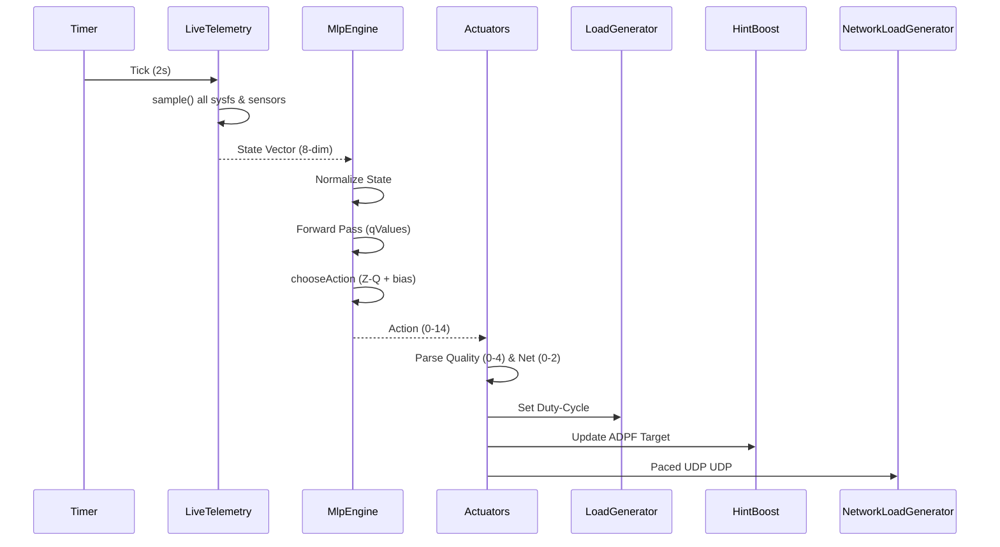

# Technical Reference

This document serves as the deep technical reference for the iQOO Game Mode RL Booster architecture, internal data structures, algorithms, and integration details.

---

## 1. System Architecture

The core runtime operates on a precise 2-second tick loop.



---

## 2. State Vector (8-dim)

The system observes the environment through an 8-dimensional continuous state vector, fused every 2 seconds by `LiveTelemetry`.

| # | Dimension | Unit | Hardware Source | NORM_MEAN | NORM_STD | Plausibility Bounds |
|---|-----------|------|-----------------|-----------|----------|---------------------|
| 0 | chipC | °C | `/sys/class/thermal/thermal_zoneN/temp` (chip) | 55.0 | 15.0 | -10..130 |
| 1 | skinC | °C | `/sys/class/thermal/thermal_zoneN/temp` (skin) | 38.0 | 5.0 | -10..130 |
| 2 | modemC | °C | `/sys/class/thermal/thermal_zoneN/temp` (modem) | 45.0 | 10.0 | -10..130 |
| 3 | freqRatio | 0-1 | `scaling_cur_freq` / `cpuinfo_max_freq` | 0.55 | 0.25 | 0..2 |
| 4 | headroomProxy | 0-100 | ADPF PowerHAL `thermalHeadroom()` × 100 | 70.0 | 20.0 | 0..100 |
| 5 | fps | fps | LoadGenerator tick counter / elapsed | 90.0 | 40.0 | 0..500 |
| 6 | netMbps | Mbps | TrafficStats delta bytes / elapsed × 8 | 10.0 | 15.0 | 0..2000 |
| 7 | tSec | s | Session elapsed time | 300.0 | 200.0 | 0..86400 |

---

## 3. Action Space

The action space consists of 15 discrete actions mapping to a cartesian product of 5 Quality Tiers and 3 Network Tiers.
Formula: `action = qualityTier * 3 + netTier`

| Action | Quality Tier | LOAD | Net Tier | Behavior |
|--------|--------------|------|----------|----------|
| 0 | Q0 | 0.12 | N0 | Minimum workload, idle network |
| 1 | Q0 | 0.12 | N1 | Minimum workload, medium network |
| 2 | Q0 | 0.12 | N2 | Minimum workload, max line-rate |
| 3 | Q1 | 0.25 | N0 | Low workload, idle network |
| ... | ... | ... | ... | ... |
| 14 | Q4 | 0.82 | N2 | Maximum workload, max line-rate |

*Note: LOAD array = `[0.12, 0.25, 0.43, 0.62, 0.82]`*

---

## 4. Neural Network Architecture

The decision engine is a custom 3-layer Multi-Layer Perceptron (MLP) implemented in pure Kotlin.

| Layer | Dimensions | Parameter Count | Activation |
|-------|------------|-----------------|------------|
| 1 | W=(8, 128), b=(128,) | 1152 | ReLU |
| 2 | W=(128, 128), b=(128,) | 16512 | ReLU |
| 3 | W=(128, 15), b=(15,) | 1935 | Linear |
| **Total** | - | **19,603** | - |

**Binary Layout (78,412 bytes):**
1. Magic (4B)
2. Num Layers (4B)
3. For each layer:
   - Rows (4B)
   - Cols (4B)
   - Weights (float32 array)
   - Bias Length (4B)
   - Biases (float32 array)

---

## 5. Reward Function

The reward function mathematically defines optimal performance. 

R = w₀·work + w₅·netNorm − penalty − w₄·intensity·0.3

Where:
- `work = 0.7·intensity + 0.3·fpsScore`
- `fpsScore = 1 − |fps − targetFps|/targetFps` (clamped 0..1)
- `netNorm = (netMbps/30.0).clamp(0,1)`
- `penalty = [softPen(skinC, skinKnee[mode], 8)·w₁ + softPen(chipC, 90, 15)·w₂ + softPen(modemC, 50, 12)·w₃] × (0.6 + 0.8·intensity)`
- `softPen(t, knee, range) = max(0, min(1, ((t-knee)/range)²))`

> [!NOTE]
> Each profile possesses a unique 6-weight configuration array (`MODE_W`) that recalibrates these weights, directly impacting learned policies.

---

## 6. Training Pipeline

Training happens completely offline using batched Stochastic Gradient Descent (SGD) with Q-learning principles.

1. **Data Sources:** Extracts data using `parseCsv` (gamemode_trace.csv), `parseLiveCsv` (gamemode_live.csv), and `parseCollectorCsv` (session JSON/CSV).
2. **Plausibility Gate:** Drops any samples violating `PolicyConfig.plausibleState()` boundaries. Requires ≥32 usable rows.
3. **Reward Recomputation:** Ignores stored reward columns; dynamically recomputes them using the latest reward formula.
4. **Z-Clamp:** Inputs are constrained to ±10 standard deviations for numerical stability.
5. **Loss Calculation:** `Loss = MSE(y, Q(s,a))` where `y = r + γ·max(Q_next)` and `γ = 0.97`.
6. **Optimizer:** SGD, `lr=0.001`, `batchSize=32`, gradient clipping at `5.0`.
7. **NaN Rollback:** Protects the model file from divergent training updates by saving and reverting weights if a NaN is detected.

---

## 7. Profile Shaping

The system translates distinct profiles without requiring 4 isolated neural network files. Four layers are applied continuously:
1. **Reward Weights:** Modifies `MODE_W` per profile during training.
2. **Tilt Bias:** Manually adjusts the Q-value outputs to aggressively prefer certain quality tiers in specific modes.
3. **Clamp Band:** Limits accessible Action tiers to hardware-safe constraints based on mode.
4. **Thermal-Ease:** Alters `relaxPerC` for aggressive throttling in Battery/Cool modes versus lax limits in Performance.

---

## 8. ADPF Integration

ADPF (Android Dynamic Performance Framework) serves as the primary system-level CPU boosting mechanism.

- **Reflection:** Due to strict zero-dependency and framework limits, the API 34+ `PerformanceHintManager` is invoked entirely through reflection.
- **Workflow:** 
  - `createHintSession(tids, targetNs)` maps LoadGenerator threads to the ADPF session.
  - `updateTargetWorkDuration()` adjusts the frame targets dynamically.
  - `reportActualWorkDuration()` feeds back true elapsed times, triggering the underlying kernel scaling driver.

---

## 9. LoadGenerator Duty-Cycle Math

The custom LoadGenerator simulates a highly realistic, tunable 3D rendering loop to engage system governors properly.

```kotlin
val frameBudgetMs = 1000 / targetFps
val sleepMs = (frameBudgetMs * (1 - intensity)).toLong()
val sleepNs = ((frameBudgetMs * (1 - intensity) - sleepMs) * 1_000_000).toInt()
Thread.sleep(sleepMs, sleepNs)
@Volatile var blackhole = acc
```
> [!WARNING]
> The `@Volatile var blackhole = acc` instruction is mandatory. Removing it causes the Android Runtime (ART) Just-In-Time (JIT) compiler to perform dead-code elimination, resulting in infinite loops and FPS counts in the millions.

---

## 10. Network Load Generator

- **UDP Pacing:** Transmits custom paced payloads to heavily engage the modem without dropping packets unexpectedly.
- **QoS Tagging:** Sets DSCP EF `0xB8` socket tagging via `TrafficStats.setThreadStatsTag()`.
- **Payload:** Fixed at 1200 bytes.
- **No VpnService:** Removed VpnService probe completely to prevent fatal connection loops. Targets the host defined in preferences.

---

## 11. Telemetry Pipeline

All telemetry flows deterministically:
`LiveTelemetry.sample()` → Normalization → 22-col CSV dump (`gamemode_live.csv`) → Extracted for batched training. The trainer auto-detects column layouts seamlessly.

---

## 12. Storage Architecture

Data operates across three distinct storage tiers:
1. **Asset Fallback:** Embedded `.bin` files representing standard profiles.
2. **App-Private:** `files/trained_<mode>.bin` for continuous local improvement.
3. **External/Export:** `getExternalFilesDir(null)/models` and session logs via `Storage.kt` for debugging. 

---

## 12b. No-Root — Hardware APIs Only

This system operates **entirely without root access**. All sensor reads, actuation, and boost signals are delivered exclusively through hardware APIs natively exposed by the Android OS and the iQOO platform layer.

### Complete API Surface

| API | Layer | Purpose in This App |
| :--- | :---: | :--- |
| `/sys/class/thermal/thermal_zone*/temp` | Android OS (sysfs) | Read chip, skin, modem, GPU, DDR temps every tick |
| `/sys/devices/system/cpu/cpu*/cpufreq/scaling_cur_freq` | Android OS (sysfs) | Compute live freqRatio state dimension |
| `/sys/devices/system/cpu/cpu*/cpufreq/cpuinfo_max_freq` | Android OS (sysfs) | Normalise freqRatio against hardware ceiling |
| `/sys/class/kgsl/kgsl-3d0/gpubusy` | Android OS (sysfs) | GPU utilisation for telemetry logging |
| `PerformanceHintManager` (ADPF) | Android OS API 34+ | Send CPU boost hints, report WorkDuration, poll thermal headroom |
| `android.hardware.thermal.IThermal` | Android OS | Real-time thermal status callbacks and headroom polling |
| `TrafficStats.getTotalRxBytes/TxBytes` | Android OS | Compute netMbps state dimension per tick |
| `BatteryManager.EXTRA_CURRENT_NOW/VOLTAGE_NOW` | Android OS | Calculate system power draw (P = \|I\| × V) |
| `DisplayManager.getDisplay(0).getRefreshRate()` | Android OS | Read current LTPO Hz for ADPF target scaling |
| `ConnectivityManager.getActiveNetwork()` | Android OS | Detect WiFi vs 5G transport for QoS policy |
| `AccessibilityService.onAccessibilityEvent` | Android OS | Detect foreground game window for service lifecycle |
| `TrafficStats.setThreadStatsTag()` + socket `IP_TOS` | Android OS | Apply DSCP EF 0xB8 QoS marking to UDP packets |

> [!IMPORTANT]
> **No proprietary vivo/iQOO SDK is called.** The following APIs exist on the device but are intentionally **not used**: `vendor.vivo.hardware.vperf` (IVPerf), `vivoperfservice` (IVivoPerfManager / IVivoSymPhonyManager), `com.vivo.game.IGameManager` (Game Cube). All require a vivo-signed platform key and SDK recognition token that a normal third-party app cannot obtain.

> [!NOTE]
> **Hexagon HTP v81 NPU** (`/dev/fastrpc-cdsp`) is inaccessible — the CDSP channel is denied by the device SELinux policy for normal app domains, and this ROM has no NNAPI HAL driver (`getNumberOfDevices()=0`). This is not a limitation in practice: the Q-network is 8→128→128→15 (~100k FLOPs total) and executes in **single-digit microseconds** on the Cortex CPU.

---

## 13. Safety Rails

Hardcoded constraints bypassing model control to guarantee device stability:
1. **Battery Brake:** Restricts upper bounds if user sliders override.
2. **Chip Emergency:** Hard throttles if GPU/CPU exceeds 90°C.
3. **NaN Fallback:** Safeguards against weight explosions.
4. **Plausibility Gate:** Drops poisoned/invalid data.
5. **Battery Floor Check:** Ensures the device has enough charge to sustain heavy workloads.

---

## 14. SharedPreferences Contract

File: `gamemode.xml`

| Key | Type | Default | Notes |
|-----|------|---------|-------|
| `mode` | String | "balanced" | |
| `active_model` | String | "" | |
| `target_temp_c` | Float | 45.0f | **CRITICAL:** Use `getFloat`/`putFloat`. Type mismatch crashes the pipeline. |
| `target_fps` | Int | 120 | |
| `net_load_enabled`| Boolean | false | |
| `net_host` | String | "8.8.8.8" | |
| `bias_{mode}_{0..4}` | Float | 0.0f | Weights page tilt, per-profile per-tier. |

---

## 15. Cross-Profile Model Persistence v1.1.0

Under the v1.1.0 doctrine, a universally trained model (usually Performance) runs persistently across all profile switches. The active model responds in real-time to the constraints imposed by the selected profile's structural modifiers (tilt, knee, scale), preventing the need to independently train 4 redundant neural networks.
